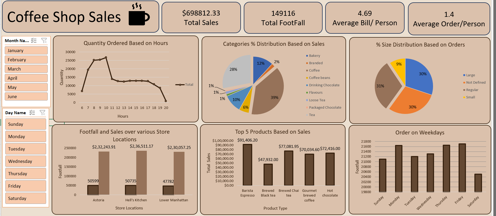

# ☕ Coffee Shop Sales Analysis Dashboard | Excel

## 📌 Project Overview
This project focuses on analyzing **coffee shop retail sales data** to gain **actionable business insights** that help improve overall store performance.

The analysis is performed using **Microsoft Excel**, and insights are presented through an **interactive dashboard** along with a **Recommended Analysis (case study) document**.

This project is part of my **Data Analyst portfolio**.

---

## 📊 Dashboard Preview
> 📌 One main dashboard screenshot for quick understanding.



---

## 🎯 Project Objectives
- Analyze **sales performance** across time (hour, day, month)
- Understand **customer behavior and purchasing patterns**
- Identify **top-performing products and categories**
- Compare performance across **store locations**
- Support **data-driven business decisions**

---

## 📄 Recommended Analysis (Business Questions)
A detailed **Recommended Analysis PDF** is included at the root of this repository and answers questions such as:

- How do sales vary by **day of the week** and **hour of the day**?
- What are the **peak sales times**?
- What is the **total sales revenue by month**?
- How do sales vary across **store locations**?
- What is the **average bill value per customer**?
- Which products are the **best-selling** by quantity and revenue?
- How do sales vary by **product category and product type**?

📎 **File:**  
`recommended_analysis.pdf`

---

## 🛠️ Tools & Technologies
- **Microsoft Excel**
  - Data Cleaning & Preparation
  - Pivot Tables & Pivot Charts
  - Interactive Slicers & Filters
  - Dashboard Design & Visualization

---

## 🔍 Key Insights
- **Morning hours (8 AM – 10 AM)** generate the highest sales and footfall
- **Weekdays outperform weekends** in customer traffic
- **Monthly sales trends** show consistent performance
- **Coffee and Tea** contribute the majority of total revenue
- Certain **store locations consistently outperform** others

---

## 📈 Business Value
This analysis helps in:
- Optimizing staffing during **peak hours**
- Improving **inventory planning and product promotions**
- Identifying **high-performing stores and products**
- Supporting **data-driven business decisions**

---

## 🧠 What I Learned
- Translating business requirements into analytical questions
- Cleaning and analyzing retail sales data using Excel
- Building interactive dashboards for non-technical stakeholders
- Communicating insights through effective data storytelling

---

## 🧾 Conclusion
This project demonstrates my ability to analyze retail sales data, build interactive Excel dashboards, and communicate insights effectively — key skills required for an **entry-level Data Analyst role**.

---

## 📂 Project Structure
```text
coffee-shop-sales-analysis-excel/
│
├── Dataset/
│   └── raw_data.xlsx
│
├── Dashboard/
│   └── coffee_shop_sales_dashboard.xlsx
│
├── Screenshots/
│   └── dashboard_overview.png
│
├── recommended_analysis.pdf
│
├── README.md
│
└── LICENSE
```

---

